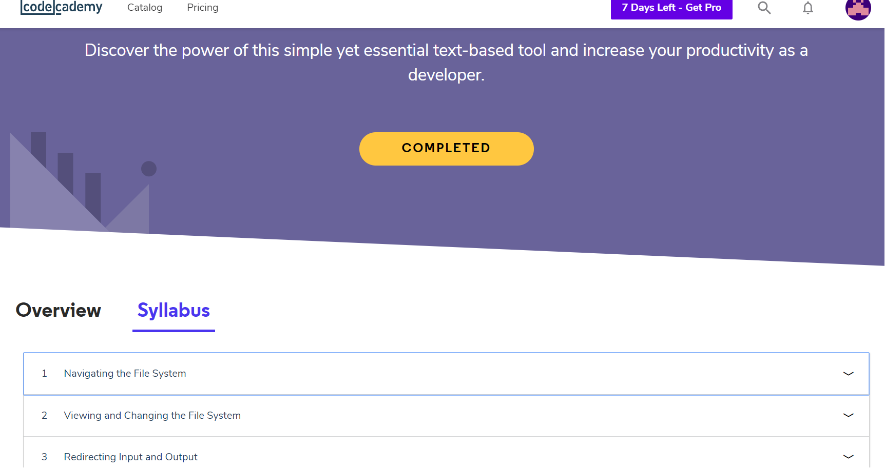
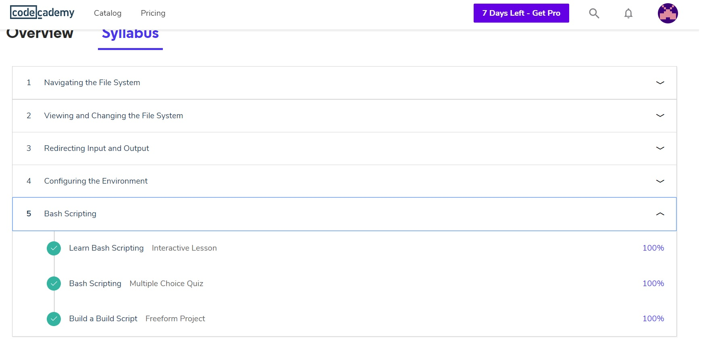
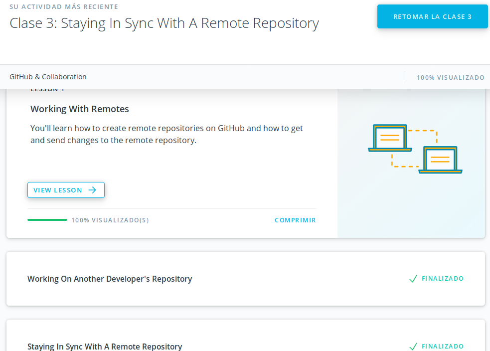
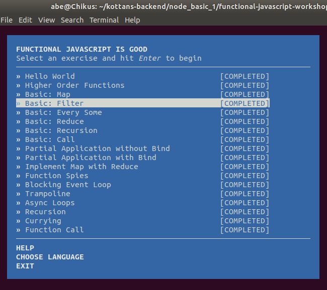
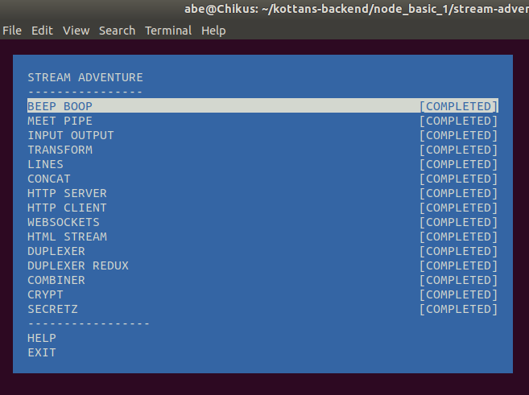
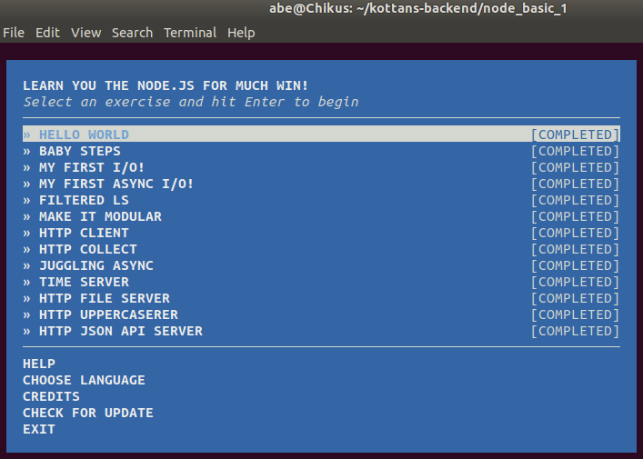
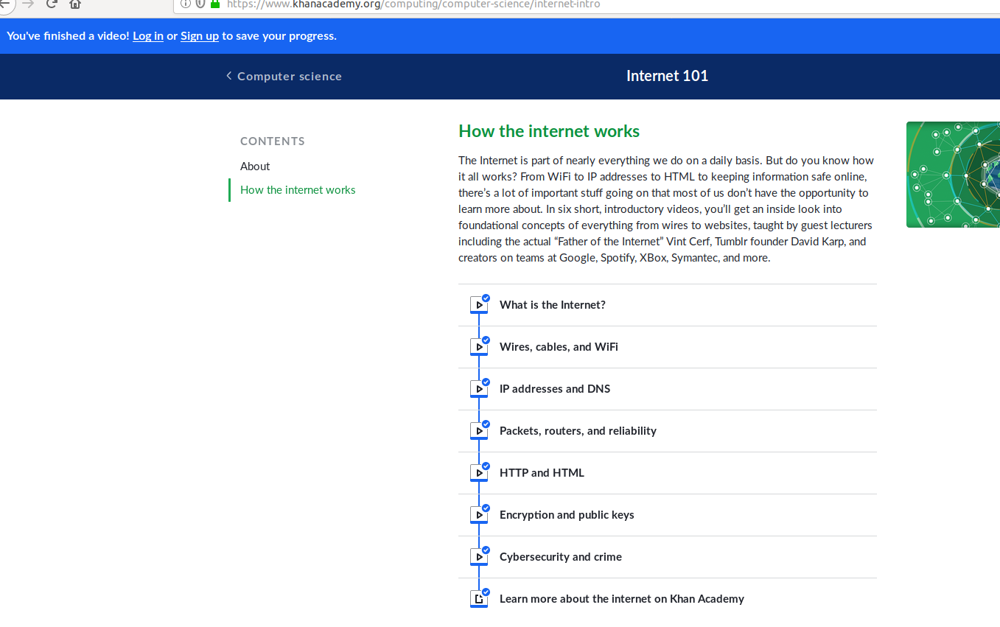
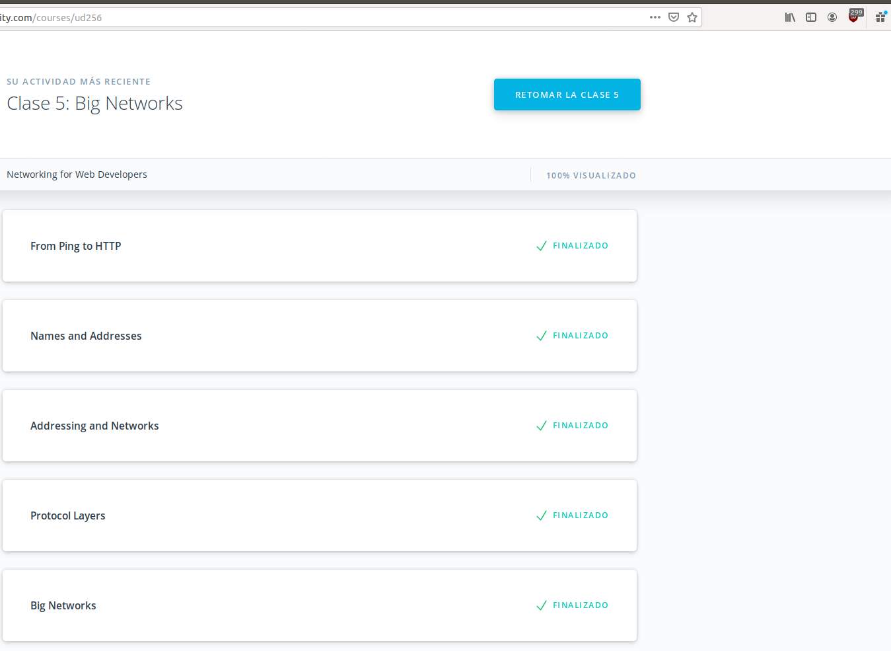

## Unix Shell


## Git Collaboration

## NodeJS Basics 1



## Memory Management
1) What's going to happen if program reaches maximum limit of stack?
- Usually the RLIMIT_STACK is 8MB, if our program reaches this limit, we have a stack overflow and the program receives a Segmentation Fault.
2) What's going to happen if program requests a big (more then 128KB) memory allocation on heap?
- The C library will create such an anonymous mapping instead of using heap memory. 128KB is the default value, but it can be adjustable and in some cases it goes to the heap or anonymous mapping.
3) What's the difference between Text and Data memory segments ?
- Data store all variables initialized, Text store all strings and maps your binary file in memory, to get the history of your program in a Segmentation Fault.


```md
55f30dcf4000-55f30ddf8000 r-xp 00000000 08:01 786440                     /bin/bash
55f30dff7000-55f30dffb000 r--p 00103000 08:01 786440                     /bin/bash
55f30dffb000-55f30e004000 rw-p 00107000 08:01 786440                     /bin/bash
55f30e004000-55f30e00e000 rw-p 00000000 00:00 0
55f30face000-55f30faef000 rw-p 00000000 00:00 0                          [heap]
7ff55fb65000-7ff560534000 r--p 00000000 08:01 1449170                    /usr/lib/locale/locale-archive
7ff560534000-7ff56071b000 r-xp 00000000 08:01 1185779                    /lib/x86_64-linux-gnu/libc-2.27.so
7ff56071b000-7ff56091b000 ---p 001e7000 08:01 1185779                    /lib/x86_64-linux-gnu/libc-2.27.so
7ff56091b000-7ff56091f000 r--p 001e7000 08:01 1185779                    /lib/x86_64-linux-gnu/libc-2.27.so
7ff56091f000-7ff560921000 rw-p 001eb000 08:01 1185779                    /lib/x86_64-linux-gnu/libc-2.27.so
7ff560921000-7ff560925000 rw-p 00000000 00:00 0
7ff560925000-7ff560928000 r-xp 00000000 08:01 1185802                    /lib/x86_64-linux-gnu/libdl-2.27.so
7ff560928000-7ff560b27000 ---p 00003000 08:01 1185802                    /lib/x86_64-linux-gnu/libdl-2.27.so
7ff560b27000-7ff560b28000 r--p 00002000 08:01 1185802                    /lib/x86_64-linux-gnu/libdl-2.27.so
7ff560b28000-7ff560b29000 rw-p 00003000 08:01 1185802                    /lib/x86_64-linux-gnu/libdl-2.27.so
7ff560b29000-7ff560b4e000 r-xp 00000000 08:01 1185937                    /lib/x86_64-linux-gnu/libtinfo.so.5.9
7ff560b4e000-7ff560d4e000 ---p 00025000 08:01 1185937                    /lib/x86_64-linux-gnu/libtinfo.so.5.9
7ff560d4e000-7ff560d52000 r--p 00025000 08:01 1185937                    /lib/x86_64-linux-gnu/libtinfo.so.5.9
7ff560d52000-7ff560d53000 rw-p 00029000 08:01 1185937                    /lib/x86_64-linux-gnu/libtinfo.so.5.9
7ff560d53000-7ff560d7a000 r-xp 00000000 08:01 1185751                    /lib/x86_64-linux-gnu/ld-2.27.so
7ff560f60000-7ff560f65000 rw-p 00000000 00:00 0
7ff560f73000-7ff560f7a000 r--s 00000000 08:01 137998                     /usr/lib/x86_64-linux-gnu/gconv/gconv-modules.cache
7ff560f7a000-7ff560f7b000 r--p 00027000 08:01 1185751                    /lib/x86_64-linux-gnu/ld-2.27.so
7ff560f7b000-7ff560f7c000 rw-p 00028000 08:01 1185751                    /lib/x86_64-linux-gnu/ld-2.27.so
7ff560f7c000-7ff560f7d000 rw-p 00000000 00:00 0
7ffcba391000-7ffcba3b2000 rw-p 00000000 00:00 0                          [stack]
7ffcba3f3000-7ffcba3f6000 r--p 00000000 00:00 0                          [vvar]
7ffcba3f6000-7ffcba3f7000 r-xp 00000000 00:00 0                          [vdso]
ffffffffff600000-ffffffffff601000 r-xp 00000000 00:00 0                  [vsyscall]
```
`Heap - 55f30face000-55f30faef000`, `Stack - 7ffcba391000-7ffcba3b2000`, `MMS - 7ff560534000-7ff56071b000`

_What is new to you_: all

_What surprised you_: I understand why use functions

_What you intend to use in the future_: Verify my code with tools to avoid mem leaks, this is very important because the code will run all time in a server forever.

## TCP. UDP Network


_What is new to you_: All

_What surprised you_: It was a cool video internet101, I liked a lot

_What you intend to use in the future_: Reduction functionality so cool

## HTTP & HTTPS
```
    curl https://api.github.com/users/Chikus
    curl -i https://api.github.com/users/Chikus
    curl --user "Chikus:blabla" https://api.github.com/gists/starred
    curl --user "Chikus:*******" https://api.github.com/gists/starred
    curl --user "Chikus" https://api.github.com/gists/starred
    curl -i https://api.github.com/orgs/kottans/repos
    curl --user "Chikus" -X POST -d '{"title":"New issue","body":"Tutorial issue test","labels":["test_bug"]}' https://api.github.com/repos/Chikus/kottans-backend/issues
 ```
1) Name at least three possible negative consequences of not using https.
- No certificates, no keys, no authentication.
2) Explain the main idea behind public key cryptography in few sentences
- There are two type of key authentication, synchronous and asynchronous, in the case of syn there is only one type of key. and in asyn there are two keys one private an another public, basically public key is for ensure that only the receiver can open this message with the public key.
3) You are creating an application for pet clinic. You need to implement the following functionality:
- POST Status code:204 body add new pet (including name, age, breed, owner's name, medical history)
- GET Status code:200 search pet by name
- PUT Status code:204 change name of an existing pet
- PUT Status code:204 add new info about pet's health
- POST Status code:200 assign a pet to a particular doctor in the clinic
- POST Status code:205 register an appointment for a pet. This request should include info about pet, doctor and appointment date and time.

## Patterns

_What is new to you_: Different architectures

_What surprised you_: Your request for this course, this is so long to finish

_What you intend to use in the future_: To be honest, this course could be compress, just watch the section 8, and maybe give an introduction to UML, explanation of the main type of architectures and different between them, I think this is all what we need to know. Taking care how to design systems with high cohesion and low coupling.

## File System


## Data Base Basic

